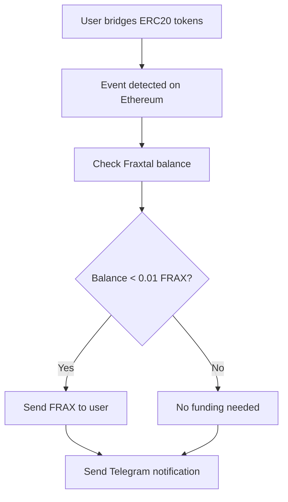

# 🌉 Aiden Bridge Agent

An intelligent agent that monitors token bridge transactions and automatically funds user wallets on Fraxtal L2. Built with the `@iqai/adk` library and integrated with Telegram notifications.

## 🚀 Features

- **Real-time Bridge Monitoring**: Watches Ethereum mainnet for ERC20 token bridge events
- **Automatic Funding**: Funds user wallets on Fraxtal L2 when they bridge any ERC20 tokens
- **Telegram Integration**: Sends notifications about bridge events and funding activities
- **Universal Token Support**: Processes bridges for any ERC20 token
- **Retry Logic**: Robust error handling with automatic retries

## 🚀 Get Started

### Prerequisites
- Node.js 18+
- PNPM package manager
- Ethereum RPC endpoint
- Fraxtal RPC endpoint
- Telegram bot token (optional)

### Installation

```bash
git clone https://github.com/IQAICOM/aiden-bridge-agent.git
cd aiden-bridge-agent
```

```bash
pnpm install
```

### Environment Setup

```bash
cp .env.example .env
```

### Run the Agent

```bash
pnpm dev
```

## 🔄 How It Works

1. **Event Monitoring**: The agent watches the bridge contract on Ethereum for `ERC20BridgeInitiated` events
2. **Universal Processing**: Processes bridge events for any ERC20 token
3. **Balance Check**: Checks if the recipient has sufficient ETH on Fraxtal L2
4. **Auto Funding**: Sends ETH to users who need it for transaction fees
5. **Notifications**: Sends updates via Telegram about bridge events and funding activities

## 📊 Event Flow



## 🤖 Telegram Integration

The agent uses a Telegram agent to send notifications about:
- Bridge events detected
- Funding transactions completed
- Funding skipped (sufficient balance)

Messages are automatically formatted and sent to your configured Telegram chat.

## 🛠️ Development

### Project Structure
- **Services**: Core business logic separated by responsibility
- **Agents**: AI agents for external integrations (Telegram)
- **Events**: Internal event system for loose coupling
- **Constants**: Centralized configuration

## 🚨 Error Handling

- **Retry Logic**: Failed transactions are retried up to 3 times
- **Balance Checks**: Prevents funding when funder wallet is low
- **Event Filtering**: Robust filtering prevents processing irrelevant events
- **Graceful Degradation**: Continues monitoring even if individual transactions fail

## 📄 License

MIT License - see the [LICENSE](LICENSE) file for details.
