# 🌉 Bridge Monitor Agent

An intelligent agent that monitors IQ token bridge transactions and automatically funds user wallets on Fraxtal L2. Built with the `@iqai/adk` library and integrated with Telegram notifications.

## 🚀 Features

- **Real-time Bridge Monitoring**: Watches Ethereum mainnet for IQ token bridge events
- **Automatic Funding**: Funds user wallets on Fraxtal L2 when they bridge IQ tokens
- **Telegram Integration**: Sends notifications about bridge events and funding activities
- **Threshold-based**: Only processes bridges above a minimum IQ threshold
- **Retry Logic**: Robust error handling with automatic retries

## 🏗️ Architecture

```
├── src/
│   ├── agents/
│   │   └── telegram-agent.ts      # Telegram notification agent
│   ├── services/
│   │   ├── bridge-monitor.ts      # Main orchestrator service
│   │   ├── event-watcher.ts       # Blockchain event monitoring
│   │   ├── funding.ts             # Wallet funding logic
│   │   └── wallet.ts              # Wallet management
│   ├── lib/
│   │   ├── constants.ts           # Configuration constants
│   │   ├── events.ts              # Event emitter for notifications
│   │   └── bridge-event.abi.ts    # Smart contract ABI
│   ├── env.ts                     # Environment configuration
│   └── index.ts                   # Application entry point
```

## 🚀 Get Started

### Prerequisites
- Node.js 18+
- PNPM package manager
- Ethereum RPC endpoint
- Fraxtal RPC endpoint
- Telegram bot token (optional)

### Installation

```bash
git clone <repository-url>
cd bridge-monitor-agent
```

```bash
pnpm install
```

### Environment Setup

```bash
cp .env.example .env
```

Configure your environment variables:

```env
# Blockchain Configuration
ETHEREUM_RPC_URL=https://eth-mainnet.g.alchemy.com/v2/your-key
FRAXTAL_RPC_URL=https://rpc.frax.com
FUNDER_PRIVATE_KEY=your-private-key-here

# Telegram Configuration (Optional)
TELEGRAM_BOT_TOKEN=your-bot-token
TELEGRAM_CHAT_ID=your-chat-id
TELEGRAM_SERVER_KEY=your-server-key
TELEGRAM_PROFILE_ID=your-profile-id

# Debug
DEBUG=true
```

### Run the Agent

```bash
pnpm dev
```

## ⚙️ Configuration

The agent can be configured via constants in `src/lib/constants.ts`:

```typescript
// Bridge contract address on Ethereum
export const BRIDGE_ADDRESS = "0x34c0bd5877a5ee7099d0f5688d65f4bb9158bde2";

// IQ token addresses
export const IQ_TOKEN_ETHEREUM_ADDRESS = "0x579CEa1889991f68aCc35Ff5c3dd0621fF29b0C9";
export const IQ_TOKEN_FRAXTAL_ADDRESS = "0x6EFB84bda519726Fa1c65558e520B92b51712101";

// Funding configuration
export const FUNDING_AMOUNT = parseEther("0.0001");     // 0.0001 ETH per user
export const MIN_IQ_THRESHOLD = parseEther("1500");     // Minimum 1500 IQ to trigger funding
```

## 🔄 How It Works

1. **Event Monitoring**: The agent watches the bridge contract on Ethereum for `ERC20BridgeInitiated` events
2. **IQ Token Filtering**: Only processes events for IQ token bridges
3. **Threshold Check**: Verifies the bridged amount meets the minimum threshold (1500 IQ)
4. **Balance Check**: Checks if the recipient has sufficient ETH on Fraxtal L2
5. **Auto Funding**: Sends ETH to users who need it for transaction fees
6. **Notifications**: Sends updates via Telegram about bridge events and funding activities

## 📊 Event Flow

```mermaid
graph TD
    A[User bridges IQ tokens] --> B[Event detected on Ethereum]
    B --> C{Amount ≥ 1500 IQ?}
    C -->|No| D[Skip funding]
    C -->|Yes| E[Check Fraxtal balance]
    E --> F{Balance < 0.0001 ETH?}
    F -->|No| G[No funding needed]
    F -->|Yes| H[Send ETH to user]
    H --> I[Send Telegram notification]
    D --> I
    G --> I
```



## 🤖 Telegram Integration

The agent uses a Telegram agent to send notifications about:
- Bridge events detected
- Funding transactions completed
- Funding skipped (insufficient balance or below threshold)

Messages are automatically formatted and sent to your configured Telegram chat.

## 🛠️ Development

### Project Structure
- **Services**: Core business logic separated by responsibility
- **Agents**: AI agents for external integrations (Telegram)
- **Events**: Internal event system for loose coupling
- **Constants**: Centralized configuration

### Key Services
- `BridgeMonitorService`: Main orchestrator
- `EventWatcherService`: Blockchain event monitoring
- `FundingService`: Wallet funding logic
- `WalletService`: Blockchain client management

### Adding New Features
1. Create new services in `src/services/`
2. Add event handlers in `src/lib/events.ts`
3. Update the main orchestrator in `src/index.ts`
4. Add Telegram notifications as needed

## 🔧 Monitoring & Stats

The agent provides real-time statistics:
- Current monitoring status
- Funder wallet balance
- Last bridge event processed
- Last funding transaction

Access stats via the `getStats()` method on the monitor service.

## 🚨 Error Handling

- **Retry Logic**: Failed transactions are retried up to 3 times
- **Balance Checks**: Prevents funding when funder wallet is low
- **Event Filtering**: Robust filtering prevents processing irrelevant events
- **Graceful Degradation**: Continues monitoring even if individual transactions fail

## 📄 License

MIT License - see the [LICENSE](LICENSE) file for details.

## 🆘 Support

If you encounter any issues:
- Check your environment variables
- Verify RPC endpoints are accessible
- Ensure private key has sufficient balance
- Check Telegram bot configuration

For technical support, create an issue in the repository.
